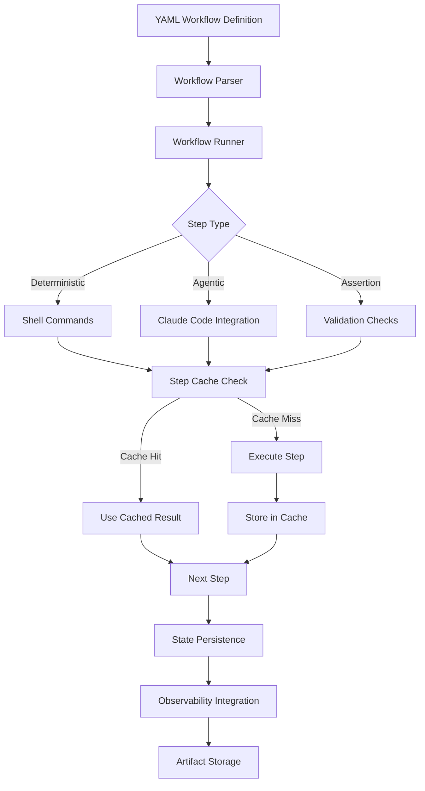

# 🔄 Phase 2: Workflow Orchestration Implementation Plan

## Overview

Phase 2 builds upon the solid foundation of Phase 0 (Enterprise Governance) and Phase 1 (Advanced Observability) to deliver structured workflow orchestration that enables reliable, repeatable, and observable automation workflows.

## 🎯 Phase 2 Objectives

### Primary Goals
1. **Structured Workflow System**: YAML-based workflow definitions with deterministic and agentic steps
2. **State Management**: Persistent workflow state with resume/replay capabilities  
3. **Step Caching**: Intelligent caching of workflow steps to avoid redundant operations
4. **Artifact Management**: Secure storage and versioning of workflow artifacts
5. **Integration**: Deep integration with Phase 1 observability for full workflow visibility

### Business Value
- **Workflow Reliability**: Consistent execution of complex multi-step processes
- **Developer Productivity**: Pre-built workflows for common enterprise tasks
- **Operational Excellence**: Observable, debuggable, and maintainable automation
- **Cost Optimization**: Step caching reduces redundant LLM calls
- **Quality Assurance**: Built-in validation and testing frameworks

## 🏗️ Technical Architecture



## 📋 Phase 2 Implementation Plan

### Epic 1: Workflow Definition System (Week 1)
#### 1.1 YAML Schema Design
- [ ] Define comprehensive workflow YAML schema
- [ ] Support for deterministic, agentic, and assertion steps
- [ ] Variable substitution and templating system
- [ ] Input/output parameter definitions
- [ ] Conditional execution and branching logic

#### 1.2 Workflow Parser and Validator
- [ ] YAML parsing with schema validation
- [ ] Dependency resolution and execution planning
- [ ] Variable interpolation engine
- [ ] Workflow syntax validation and linting

### Epic 2: Workflow Execution Engine (Week 2)
#### 2.1 Core Workflow Runner
- [ ] Multi-step workflow execution engine
- [ ] Support for parallel and sequential execution
- [ ] Error handling and retry logic
- [ ] Timeout and resource management

#### 2.2 Step Execution Framework
- [ ] Shell command execution with environment isolation
- [ ] Claude Code integration for agentic steps
- [ ] Assertion and validation step execution
- [ ] Custom step type extensibility

### Epic 3: State Management & Caching (Week 3)
#### 3.1 Persistent State Management
- [ ] DynamoDB-based workflow state storage
- [ ] Resume from any step capability
- [ ] Workflow history and audit trail
- [ ] Concurrent execution protection

#### 3.2 Intelligent Step Caching
- [ ] Content-based cache key generation
- [ ] Step result caching in S3
- [ ] Cache invalidation strategies
- [ ] Cache hit rate optimization

### Epic 4: Artifact Management (Week 3)
#### 4.1 Artifact Storage System
- [ ] S3-based artifact storage
- [ ] Versioned artifact management
- [ ] Secure artifact access controls
- [ ] Artifact lifecycle management

#### 4.2 Artifact Integration
- [ ] Step input/output artifact handling
- [ ] Workflow artifact dependencies
- [ ] Artifact sharing between workflows
- [ ] Artifact metadata and tagging

### Epic 5: Reference Workflows (Week 4)
#### 5.1 Core Workflow Templates
- [ ] Increase test coverage workflow
- [ ] Fix typing errors workflow
- [ ] Code migration workflow
- [ ] Documentation generation workflow

#### 5.2 Advanced Workflow Templates
- [ ] Security vulnerability scanning workflow
- [ ] Performance optimization workflow
- [ ] Code review automation workflow
- [ ] Deployment validation workflow

### Epic 6: Observability Integration (Week 4)
#### 6.1 Workflow Telemetry
- [ ] Workflow execution tracing
- [ ] Step-level performance metrics
- [ ] Cache hit rate monitoring
- [ ] Workflow success/failure analytics

#### 6.2 Enhanced Dashboards
- [ ] Workflow execution dashboard
- [ ] Step performance analytics
- [ ] Cache efficiency metrics
- [ ] Workflow ROI calculations

## 📊 Implementation Status

### Epic 1: Workflow Definition System 📋 PLANNED
#### 1.1 YAML Schema Design
- [ ] Define comprehensive workflow YAML schema
- [ ] Support for deterministic, agentic, and assertion steps
- [ ] Variable substitution and templating system
- [ ] Input/output parameter definitions
- [ ] Conditional execution and branching logic

#### 1.2 Workflow Parser and Validator
- [ ] YAML parsing with schema validation
- [ ] Dependency resolution and execution planning
- [ ] Variable interpolation engine
- [ ] Workflow syntax validation and linting

### Epic 2: Workflow Execution Engine 📋 PLANNED
#### 2.1 Core Workflow Runner
- [ ] Multi-step workflow execution engine
- [ ] Support for parallel and sequential execution
- [ ] Error handling and retry logic
- [ ] Timeout and resource management

#### 2.2 Step Execution Framework
- [ ] Shell command execution with environment isolation
- [ ] Claude Code integration for agentic steps
- [ ] Assertion and validation step execution
- [ ] Custom step type extensibility

### Epic 3: State Management & Caching 📋 PLANNED
#### 3.1 Persistent State Management
- [ ] DynamoDB-based workflow state storage
- [ ] Resume from any step capability
- [ ] Workflow history and audit trail
- [ ] Concurrent execution protection

#### 3.2 Intelligent Step Caching
- [ ] Content-based cache key generation
- [ ] Step result caching in S3
- [ ] Cache invalidation strategies
- [ ] Cache hit rate optimization

### Epic 4: Artifact Management 📋 PLANNED
#### 4.1 Artifact Storage System
- [ ] S3-based artifact storage
- [ ] Versioned artifact management
- [ ] Secure artifact access controls
- [ ] Artifact lifecycle management

#### 4.2 Artifact Integration
- [ ] Step input/output artifact handling
- [ ] Workflow artifact dependencies
- [ ] Artifact sharing between workflows
- [ ] Artifact metadata and tagging

### Epic 5: Reference Workflows 📋 PLANNED
#### 5.1 Core Workflow Templates
- [ ] Increase test coverage workflow
- [ ] Fix typing errors workflow
- [ ] Code migration workflow
- [ ] Documentation generation workflow

#### 5.2 Advanced Workflow Templates
- [ ] Security vulnerability scanning workflow
- [ ] Performance optimization workflow
- [ ] Code review automation workflow
- [ ] Deployment validation workflow

### Epic 6: Observability Integration 📋 PLANNED
#### 6.1 Workflow Telemetry
- [ ] Workflow execution tracing
- [ ] Step-level performance metrics
- [ ] Cache hit rate monitoring
- [ ] Workflow success/failure analytics

#### 6.2 Enhanced Dashboards
- [ ] Workflow execution dashboard
- [ ] Step performance analytics
- [ ] Cache efficiency metrics
- [ ] Workflow ROI calculations

## 🛠️ Technical Specifications

### Workflow Definition Schema

```yaml
# Example workflow definition
name: increase-test-coverage
version: "1.0"
description: "Increase test coverage for a given file to target percentage"

inputs:
  target_file:
    type: string
    required: true
    description: "Path to the file to increase coverage for"
  target_coverage:
    type: number
    default: 90
    description: "Target coverage percentage"
  
outputs:
  coverage_report:
    type: artifact
    description: "Updated coverage report"
  tests_added:
    type: number
    description: "Number of tests added"

steps:
  - id: baseline
    type: shell
    command: "pytest --cov --cov-report=xml {{ inputs.target_file }}"
    cache_key: "coverage-{{ hash(inputs.target_file) }}"
    outputs:
      coverage_xml: "./coverage.xml"
      
  - id: check_current_coverage
    type: assert  
    condition: "parse_coverage(baseline.outputs.coverage_xml).line_coverage < {{ inputs.target_coverage }}"
    message: "Coverage already meets target"
    
  - id: generate_tests
    type: claude_code
    security_profile: "restricted"
    use_cache: true
    prompt: |
      Analyze the file {{ inputs.target_file }} and the current test coverage report.
      Generate additional tests to reach {{ inputs.target_coverage }}% line coverage.
      Focus on uncovered lines and edge cases.
    inputs:
      - "{{ inputs.target_file }}"
      - "{{ baseline.outputs.coverage_xml }}"
    cache_key: "tests-{{ hash(inputs.target_file, inputs.target_coverage) }}"
    
  - id: verify_coverage
    type: shell
    command: "pytest --cov --cov-report=xml {{ inputs.target_file }}"
    outputs:
      final_coverage_xml: "./coverage.xml"
      
  - id: validate_target
    type: assert
    condition: "parse_coverage(verify_coverage.outputs.final_coverage_xml).line_coverage >= {{ inputs.target_coverage }}"
    message: "Failed to achieve target coverage"
    
  - id: create_pr
    type: shell
    command: |
      git add .
      git commit -m "Increase test coverage for {{ inputs.target_file }} to {{ inputs.target_coverage }}%"
      gh pr create --title "Increase test coverage: {{ inputs.target_file }}" \
        --body "Automated test generation to achieve {{ inputs.target_coverage }}% coverage"
    when: "{{ env.CREATE_PR == 'true' }}"
```

### State Management

```python
# Workflow state schema
{
  "workflow_id": "uuid",
  "workflow_name": "increase-test-coverage",
  "workflow_version": "1.0",
  "execution_id": "uuid", 
  "status": "running|completed|failed|paused",
  "current_step": "generate_tests",
  "steps": {
    "baseline": {
      "status": "completed",
      "started_at": "2025-01-15T10:00:00Z",
      "completed_at": "2025-01-15T10:00:30Z",
      "outputs": {...},
      "cache_key": "coverage-abc123",
      "cached": false
    }
  },
  "inputs": {...},
  "outputs": {...},
  "artifacts": [...],
  "created_at": "2025-01-15T10:00:00Z",
  "updated_at": "2025-01-15T10:05:00Z"
}
```

### Cache Management

```python
# Step cache key generation
def generate_cache_key(step_config, inputs, context):
    """Generate deterministic cache key for step execution"""
    key_components = [
        step_config.get('cache_key', ''),
        hash(json.dumps(inputs, sort_keys=True)),
        hash(json.dumps(step_config, sort_keys=True)),
        context.get('cache_version', '1.0')
    ]
    return hashlib.sha256('|'.join(key_components).encode()).hexdigest()
```

## 🎯 Success Metrics

### Phase 2 Completion Criteria
- [ ] **Workflow Execution**: Successfully run all reference workflows end-to-end
- [ ] **State Persistence**: Demonstrate resume from any workflow step
- [ ] **Cache Efficiency**: Achieve >70% cache hit rate on repeated workflows
- [ ] **Observability**: Full workflow visibility in Phase 1 dashboards
- [ ] **Performance**: <10 second overhead for workflow orchestration
- [ ] **Reliability**: 99.9% workflow execution success rate

### Business Impact Goals
- **Developer Productivity**: 50% reduction in manual task execution time
- **Workflow Reliability**: 95% first-time workflow success rate
- **Cost Optimization**: 40% reduction in redundant LLM calls via caching
- **Quality Improvement**: 90% of workflows include automated validation

## 🔗 Integration Points

### Phase 1 Observability Integration
- Workflow execution spans in OpenTelemetry
- Step-level performance metrics in CloudWatch
- Workflow success/failure alerts
- Cache hit rate monitoring

### Phase 0 Governance Integration  
- Security profile enforcement for agentic steps
- Policy compliance validation
- Audit trail generation
- Permission-based workflow access

## 🚀 Deployment Strategy

### Infrastructure Requirements
- **AWS ECS/Fargate**: Workflow runner containers
- **Amazon DynamoDB**: Workflow state storage
- **Amazon S3**: Artifact and cache storage
- **AWS Lambda**: Workflow triggers and webhooks
- **Amazon EventBridge**: Workflow event routing

### Rollout Plan
1. **Week 1-2**: Core workflow engine development
2. **Week 3**: State management and caching
3. **Week 4**: Reference workflows and observability
4. **Week 5**: Testing and validation
5. **Week 6**: Production deployment

## 📚 Documentation Plan

### User Documentation
- [ ] Workflow authoring guide
- [ ] Reference workflow catalog
- [ ] Best practices and patterns
- [ ] Troubleshooting guide

### Technical Documentation
- [ ] Architecture deep dive
- [ ] API reference
- [ ] Deployment guide
- [ ] Performance tuning guide

---

**Phase 2 Goal**: Deliver enterprise-grade workflow orchestration that enables reliable, observable, and cost-effective automation workflows building on the solid foundation of Phase 0 and Phase 1.

**Expected Timeline**: 4-6 weeks
**Expected Deliverables**: 15+ production-ready components
**Expected Business Value**: 50% improvement in automation reliability and developer productivity