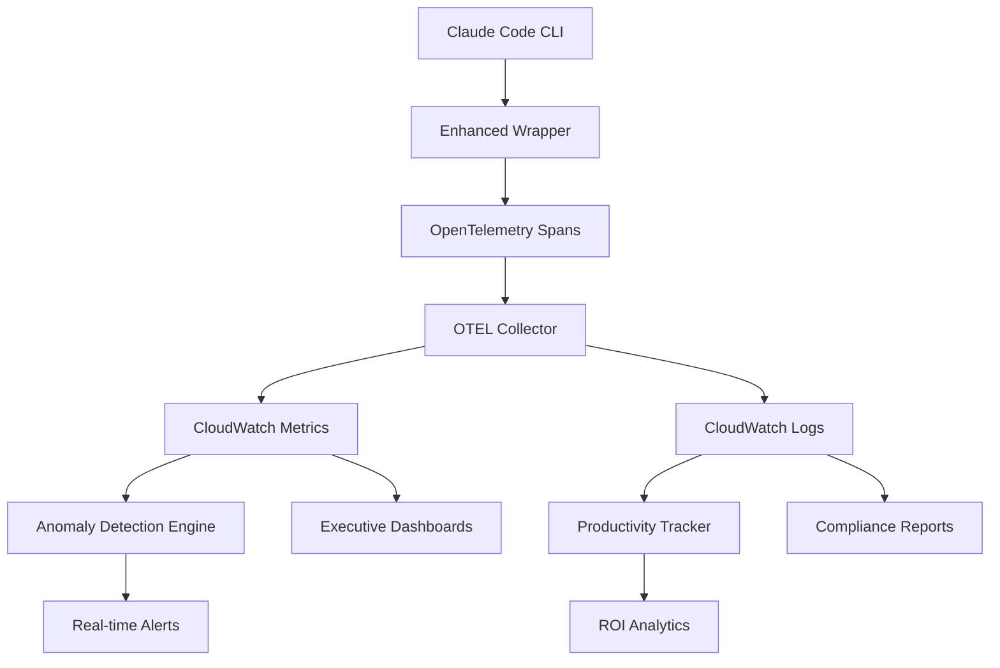

# Phase 1 Advanced Observability Guide

## Overview

Phase 1 of the Claude Code Enterprise system delivers comprehensive observability capabilities that provide deep insights into usage patterns, security compliance, cost optimization, and developer productivity. This system goes beyond basic monitoring to deliver actionable intelligence for enterprise operations.

## Architecture Overview



## Core Components

### 1. Enhanced OpenTelemetry Tracing

**Location**: `enterprise-addons/observability/spans/`

The enhanced tracing system captures detailed telemetry for every Claude Code interaction:

```python
# Initialize tracer with enterprise configuration
from claude_code_tracer import EnhancedClaudeTracer, TracingConfig

config = TracingConfig(
    service_name="claude-code-enterprise",
    environment="production",
    user_attribution=True,
    detailed_metrics=True,
    security_tracking=True
)

tracer = EnhancedClaudeTracer(config)
```

**Key Features**:
- **User Attribution**: Every span tagged with user ID, team, department
- **Security Tracking**: Policy violations, permission checks, compliance events
- **Performance Metrics**: Token usage, latency, cache hit rates, costs
- **Business Context**: Project tags, repository context, task categories

**Span Types**:
- `claude.invocation` - Core LLM interactions
- `security.check` - Permission and policy validation
- `cache.operation` - Prompt caching events
- `cost.calculation` - Real-time cost tracking
- `productivity.task` - Developer task completion

### 2. Real-time Anomaly Detection

**Location**: `enterprise-addons/observability/alerting/`

Intelligent anomaly detection using statistical analysis and machine learning:

```python
from anomaly_detection_engine import AnomalyDetectionEngine, AnomalyConfig

config = AnomalyConfig(
    detection_window_minutes=15,
    anomaly_threshold=2.5,
    alert_channels=["#ai-platform", "security-team@company.com"],
    auto_response_enabled=True
)

engine = AnomalyDetectionEngine(config)
```

**Detection Categories**:

1. **Cost Anomalies**
   - Sudden cost spikes (>3x normal)
   - Unusual usage patterns
   - Budget threshold violations

2. **Security Anomalies**
   - Policy violation clusters
   - Unusual permission requests
   - Suspicious user behavior

3. **Performance Anomalies**
   - Latency degradation
   - Error rate spikes
   - Cache miss patterns

4. **Usage Anomalies**
   - Off-hours activity
   - Unusual model selection
   - Bulk operation patterns

### 3. Advanced CloudWatch Dashboards

**Location**: `enterprise-addons/observability/dashboards/`

Multi-dimensional dashboards for different stakeholder needs:

#### Executive Dashboard
- DAU/WAU metrics with trends
- Cost breakdown by team/project
- ROI calculations and business value
- Productivity impact measurements

#### Operations Dashboard
- Real-time system health
- Performance metrics (p95, p99 latency)
- Cache hit rates and optimization opportunities
- Error rates and failure analysis

#### Security Dashboard
- Compliance scoring by security profile
- Policy violation tracking
- User behavior analytics
- Audit trail summaries

#### Developer Dashboard
- Individual productivity metrics
- Task completion rates
- Time-saving measurements
- Code quality improvements

### 4. Productivity & ROI Tracking

**Location**: `enterprise-addons/observability/metrics/`

Comprehensive productivity measurement system:

```python
from productivity_metrics import ProductivityTracker, MetricsConfig

config = MetricsConfig(
    tracking_enabled=True,
    detailed_analysis=True,
    roi_calculation=True,
    benchmark_comparison=True
)

tracker = ProductivityTracker(config)
```

**Tracked Metrics**:

1. **Developer Productivity**
   - Tasks completed per hour
   - Code quality improvements
   - Time to completion
   - Success/failure rates

2. **Business Value**
   - Time savings quantification
   - Cost per productive hour
   - ROI percentage calculations
   - Efficiency improvements

3. **Quality Indicators**
   - Code review feedback
   - Bug reduction rates
   - Test coverage improvements
   - Documentation quality

### 5. Comprehensive Monitoring Integration

**Location**: `enterprise-addons/observability/monitoring_integration.py`

Unified monitoring system that orchestrates all observability components:

```python
from monitoring_integration import ComprehensiveMonitor

monitor = ComprehensiveMonitor()

# Start monitoring session
session = monitor.start_monitoring_session(
    user_id="developer@company.com",
    team_id="platform-team",
    session_type="code_generation",
    project_context={"repo": "api-service", "task": "feature-development"}
)

# Track task completion
monitor.track_completion({
    'task_type': 'bug_fix',
    'complexity': 'medium',
    'success': True,
    'duration_seconds': 180,
    'lines_changed': 25
})
```

## Deployment Guide

### Prerequisites

1. **AWS Services**:
   - CloudWatch (metrics, logs, dashboards)
   - ECS/Fargate (OTEL collector)
   - S3 (configuration, artifacts)
   - DynamoDB (state management)
   - SNS (alerting)

2. **Permissions**:
   - CloudWatch full access
   - ECS task execution role
   - S3 read/write for configs
   - SNS publish for alerts

### Step 1: Deploy OTEL Collector

```bash
# Deploy enhanced OTEL collector on Fargate
aws cloudformation deploy \
  --template-file enterprise-addons/observability/collectors/enhanced_collector_template.yaml \
  --stack-name claude-code-otel-collector \
  --capabilities CAPABILITY_IAM \
  --parameters \
    ParameterKey=VpcId,ParameterValue=vpc-xxxxxxxx \
    ParameterKey=SubnetIds,ParameterValue="subnet-xxxxxxxx,subnet-yyyyyyyy"
```

### Step 2: Deploy Dashboards

```bash
# Create CloudWatch dashboards
aws cloudformation deploy \
  --template-file enterprise-addons/observability/dashboards/advanced_dashboard_template.yaml \
  --stack-name claude-code-dashboards \
  --parameters \
    ParameterKey=DashboardName,ParameterValue=ClaudeCodeEnterprise
```

### Step 3: Configure Enhanced Wrapper

```bash
# Update Claude Code launcher to use enhanced wrapper
export CLAUDE_CODE_WRAPPER="python3 enterprise-addons/observability/spans/enhanced_wrapper.py"
export OTEL_EXPORTER_OTLP_ENDPOINT="http://otel-collector:4317"
export ENTERPRISE_MONITORING_ENABLED="true"

# Launch Claude Code with enhanced observability
./claude-code --enterprise-mode
```

### Step 4: Enable Anomaly Detection

```bash
# Deploy anomaly detection engine
python3 enterprise-addons/observability/alerting/anomaly_detection_engine.py \
  --config-file /path/to/anomaly_config.json \
  --enable-auto-response \
  --alert-channels "#ai-platform,security-team@company.com"
```

## Configuration

### Environment Variables

```bash
# Core Configuration
export CLAUDE_CODE_SERVICE_NAME="claude-code-enterprise"
export CLAUDE_CODE_ENVIRONMENT="production"
export ENTERPRISE_MONITORING_ENABLED="true"

# OpenTelemetry Configuration
export OTEL_EXPORTER_OTLP_ENDPOINT="http://otel-collector:4317"
export OTEL_EXPORTER_OTLP_PROTOCOL="grpc"
export OTEL_SERVICE_NAME="claude-code"
export OTEL_SERVICE_VERSION="1.0.0"

# Anomaly Detection
export ANOMALY_DETECTION_ENABLED="true"
export ANOMALY_THRESHOLD="2.5"
export ALERT_CHANNELS="#ai-platform,security-team@company.com"

# Productivity Tracking
export PRODUCTIVITY_TRACKING_ENABLED="true"
export ROI_CALCULATION_ENABLED="true"
export DETAILED_METRICS_ENABLED="true"
```

### Configuration Files

#### Tracing Configuration (`tracing_config.json`)
```json
{
  "service_name": "claude-code-enterprise",
  "environment": "production",
  "user_attribution": true,
  "detailed_metrics": true,
  "security_tracking": true,
  "performance_tracking": true,
  "business_context": true,
  "export_interval_seconds": 30,
  "batch_size": 1000
}
```

#### Anomaly Detection Configuration (`anomaly_config.json`)
```json
{
  "detection_window_minutes": 15,
  "anomaly_threshold": 2.5,
  "alert_channels": ["#ai-platform", "security-team@company.com"],
  "auto_response_enabled": true,
  "detection_types": {
    "cost_anomalies": true,
    "security_anomalies": true,
    "performance_anomalies": true,
    "usage_anomalies": true
  },
  "response_actions": {
    "cost_spike": "throttle_requests",
    "security_violation": "alert_security_team",
    "performance_degradation": "scale_infrastructure"
  }
}
```

## Monitoring & Alerting

### Key Metrics

1. **Usage Metrics**
   - `claude_code.invocations.count` - Total invocations
   - `claude_code.users.active.daily` - Daily active users
   - `claude_code.teams.active` - Active teams
   - `claude_code.sessions.duration` - Session durations

2. **Performance Metrics**
   - `claude_code.latency.p95` - 95th percentile latency
   - `claude_code.cache.hit_rate` - Cache hit percentage
   - `claude_code.errors.rate` - Error rate percentage
   - `claude_code.tokens.per_second` - Token processing rate

3. **Cost Metrics**
   - `claude_code.cost.total_usd` - Total costs in USD
   - `claude_code.cost.per_team` - Cost breakdown by team
   - `claude_code.cost.per_model` - Cost breakdown by model
   - `claude_code.cost.cache_savings` - Cost savings from caching

4. **Security Metrics**
   - `claude_code.security.violations` - Policy violations
   - `claude_code.security.profile_compliance` - Compliance scores
   - `claude_code.security.anomalies` - Security anomalies detected
   - `claude_code.security.access_denied` - Access denied events

5. **Productivity Metrics**
   - `claude_code.productivity.tasks_completed` - Tasks completed
   - `claude_code.productivity.time_saved_hours` - Time saved in hours
   - `claude_code.productivity.success_rate` - Task success rate
   - `claude_code.productivity.roi_percentage` - ROI percentage

### Alert Rules

#### High Priority Alerts
- Cost spike >300% of baseline (5-minute window)
- Error rate >5% (10-minute window)
- Security policy violations >10 in 5 minutes
- System availability <99% (5-minute window)

#### Medium Priority Alerts
- Cache hit rate <50% (30-minute window)
- Unusual usage patterns detected
- Performance degradation >50% increase in latency
- Budget threshold >80% consumed

#### Low Priority Alerts
- Daily usage report
- Weekly productivity summary
- Monthly cost optimization recommendations
- Quarterly compliance review

## Troubleshooting

### Common Issues

#### 1. No Metrics Appearing in Dashboard

**Check**:
- OTEL collector is running: `aws ecs list-tasks --cluster claude-code-otel`
- Environment variables are set correctly
- Network connectivity to collector endpoint

**Solution**:
```bash
# Verify OTEL collector logs
aws logs filter-log-events \
  --log-group-name /ecs/claude-code-otel-collector \
  --start-time $(date -d '1 hour ago' +%s)000
```

#### 2. Anomaly Detection Not Triggering

**Check**:
- CloudWatch metrics are being received
- Anomaly detection engine is running
- Alert channels are configured correctly

**Solution**:
```bash
# Test anomaly detection manually
python3 enterprise-addons/observability/alerting/anomaly_detection_engine.py \
  --test-mode \
  --simulate-anomaly cost_spike
```

#### 3. High OTEL Collector Resource Usage

**Check**:
- Batch size configuration
- Export interval settings
- Memory limits on ECS task

**Solution**:
```yaml
# Adjust collector configuration
processors:
  batch:
    send_batch_size: 500  # Reduce from 1000
    timeout: 10s          # Increase from 5s
```

### Performance Optimization

#### 1. Reduce Telemetry Overhead
```python
# Configure selective tracing
config = TracingConfig(
    sampling_rate=0.1,  # Sample 10% of traces
    detailed_metrics=False,
    high_cardinality_attrs=False
)
```

#### 2. Optimize Dashboard Queries
```json
{
  "metrics": [
    {
      "metricName": "claude_code.latency.p95",
      "stat": "Average",
      "period": 300,
      "region": "us-east-1"
    }
  ],
  "period": 300,
  "region": "us-east-1",
  "timezone": "UTC"
}
```

#### 3. Efficient Anomaly Detection
```json
{
  "detection_window_minutes": 30,
  "evaluation_frequency_minutes": 5,
  "data_retention_days": 30,
  "batch_processing": true
}
```

## Security Considerations

### Data Privacy
- No sensitive prompt content stored in metrics
- User IDs hashed for privacy when required
- Retention policies enforce data lifecycle
- Access controls limit metric visibility

### Network Security
- OTEL collector runs in private subnets
- TLS encryption for all telemetry data
- VPC endpoints for AWS service access
- Security groups restrict network access

### Access Controls
- IAM roles for service authentication
- CloudWatch resource-based policies
- Dashboard access controls by team
- Alert channel permissions management

## Cost Optimization

### Telemetry Costs
- **CloudWatch Metrics**: ~$0.30 per metric per month
- **CloudWatch Logs**: ~$0.50 per GB ingested
- **ECS Fargate**: ~$0.04 per vCPU hour + $0.004 per GB hour
- **S3 Storage**: ~$0.023 per GB per month

### Optimization Strategies
1. **Metric Sampling**: Reduce high-cardinality metrics
2. **Log Retention**: Set appropriate retention periods
3. **Dashboard Optimization**: Use efficient queries
4. **Selective Monitoring**: Monitor critical paths only

### Expected Costs (1000 users)
- CloudWatch Metrics: $150/month
- CloudWatch Logs: $100/month
- ECS Fargate: $50/month
- S3 Storage: $10/month
- **Total**: ~$310/month

## Best Practices

### 1. Metric Naming
```
claude_code.<component>.<metric_type>.<specific_metric>
Examples:
- claude_code.invocation.latency.p95
- claude_code.security.violations.count
- claude_code.cost.total.usd
```

### 2. Dashboard Organization
- **Executive**: High-level business metrics
- **Operations**: System health and performance
- **Security**: Compliance and violations
- **Development**: Individual and team productivity

### 3. Alert Fatigue Prevention
- Use appropriate thresholds
- Implement alert escalation
- Provide clear remediation steps
- Regular alert review and tuning

### 4. Data Retention
- Metrics: 15 months (AWS default)
- Logs: 30 days for detailed logs, 1 year for summaries
- Traces: 30 days
- Dashboards: Historical snapshots quarterly

## Next Steps

Phase 1 provides the foundation for enterprise observability. Future phases will add:

- **Phase 2**: Advanced workflow orchestration with observability
- **Phase 3**: Predictive analytics and automated optimization
- **Phase 4**: Cross-system integration and federated monitoring

For implementation support, refer to the validation test suite in `enterprise-addons/observability/tests/` or contact the platform team.