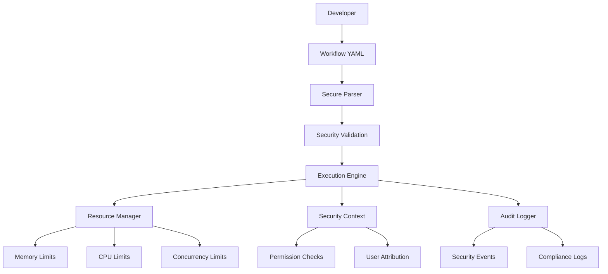

# Secure Workflow Orchestration - Phase 2

🔒 **Production-Ready** | 🚀 **Developer-Friendly** | 🏢 **Enterprise-Grade**

Enterprise-grade workflow automation with comprehensive security controls, designed for developers who need both security and productivity.

## ✨ What Makes This Special

- **🔒 Security-First Design**: Multiple security profiles from plan-only to elevated permissions
- **👨‍💻 Developer Experience**: Intuitive configuration, clear error messages, comprehensive docs
- **🏢 Enterprise Ready**: Audit trails, resource management, compliance features
- **⚡ Performance Optimized**: Intelligent caching, resource limits, concurrent execution
- **📊 Production Monitoring**: Detailed logging, metrics, health checks
- **🔧 Flexible Configuration**: Environment variables, config files, runtime overrides

## 🎯 Quick Start (5 minutes)

```bash
# 1. Install dependencies
pip install PyYAML simpleeval jinja2

# 2. Validate your environment
python testing/enterprise_deployment_validator.py

# 3. Create your first workflow
cat > hello-world.yaml << EOF
name: hello-world
version: 1.0
description: My first secure workflow
inputs:
  name: { type: string, default: "Developer" }
steps:
  - id: greet
    type: shell
    command: "echo 'Hello {{ inputs.name }}!'"
EOF

# 4. Test it out
python testing/workflow_simulator.py hello-world.yaml
```

## 🏗️ Architecture & Security Profiles

### Security Profiles for Every Use Case

| Profile | Best For | Key Features |
|---------|----------|-------------|
| **plan_only** 🔐 | Compliance-heavy orgs | Plan mode only, maximum audit trail |
| **restricted** 🛡️ | Development teams | Safe tools only, limited commands |
| **standard** ⚖️ | Most enterprises | Balanced security + productivity |
| **elevated** 🚀 | Platform/DevOps teams | Advanced permissions, infrastructure access |

### Deployment Architecture



## 📦 Core Components

### 🔧 Configuration System (`config/`)
```python
# Easy configuration management
from config.workflow_config import load_workflow_config

config = load_workflow_config()  # Auto-loads from multiple sources
print(f"Using {config.security_profile} profile in {config.environment} environment")
```

### 🔒 Secure Workflow Engine (`engine/`)
```python
# Production-ready workflow execution
from engine.secure_workflow_engine import create_secure_workflow_engine

# Choose the right security level for your team
engine = create_secure_workflow_engine('standard')  # Most teams
engine = create_development_engine()                # Development
engine = create_production_engine()                 # Production
engine = create_plan_only_engine()                  # High-security orgs
```

### 📝 Workflow Parser (`parser/`)
```python
# Robust YAML workflow processing
from parser.workflow_parser import WorkflowParser

parser = WorkflowParser()
workflow = parser.parse_workflow('my-workflow.yaml')
issues = parser.validate_workflow(workflow)  # Comprehensive validation
```

### 🧪 Testing & Validation (`testing/`)
```bash
# Comprehensive validation suite
python testing/enterprise_deployment_validator.py    # Full system check
python testing/security_tests.py                    # Security validation
python testing/workflow_simulator.py my-flow.yaml   # Test workflows safely
```

### 📚 Developer Documentation (`docs/`)
- **[Developer Setup Guide](docs/DEVELOPER_SETUP_GUIDE.md)** - Complete setup instructions
- **[Troubleshooting Guide](docs/TROUBLESHOOTING.md)** - Solve common issues quickly
- **[Security Best Practices](docs/SECURITY_BEST_PRACTICES.md)** - Write secure workflows

## 🚀 For Developers

### Environment-Specific Setup
```bash
# Development (relaxed security, debug enabled)
export CLAUDE_SECURITY_PROFILE=elevated
export CLAUDE_ENABLE_DEBUG=true
export CLAUDE_ENABLE_DETAILED_LOGGING=true

# Staging (balanced security)
export CLAUDE_SECURITY_PROFILE=standard
export CLAUDE_ENABLE_DEBUG=false

# Production (secure, optimized)
export CLAUDE_SECURITY_PROFILE=standard
export CLAUDE_ENABLE_DEBUG=false
export CLAUDE_MAX_CONCURRENT_WORKFLOWS=100
```

### Create Configuration Template
```bash
# Generate customizable config
python config/workflow_config.py --create-template my-config.yaml

# Validate your configuration
python config/workflow_config.py --validate my-config.yaml

# Show security profile details
python config/workflow_config.py --show-profile standard
```

### Writing Your First Workflow
```yaml
# my-workflow.yaml
name: deploy-application
version: 1.0
description: Deploy application with security controls

# Define inputs with validation
inputs:
  environment:
    type: string
    required: true
    validation:
      pattern: "^(dev|staging|prod)$"
  version:
    type: string
    default: "latest"

# Secure workflow steps
steps:
  - id: validate-environment
    type: assert
    condition: "inputs.environment in ['dev', 'staging', 'prod']"
    message: "Invalid environment specified"
    
  - id: run-tests
    type: shell
    command: "npm test"
    timeout: 600  # 10 minutes
    retry:
      attempts: 2
      delay: 30
      
  - id: deploy
    type: shell
    depends_on: [validate-environment, run-tests]
    command: "kubectl apply -f k8s/{{ inputs.environment }}/"
    when: "steps.run-tests.exit_code == 0"
```

## 🏢 For Enterprise Teams

### Security & Compliance
- **🔐 Multiple Security Profiles**: Right-sized permissions for each team
- **📋 Comprehensive Audit Trail**: Every action logged with user attribution
- **🛡️ Injection Prevention**: Blocks code, template, and shell injection attacks
- **⚡ Resource Management**: CPU, memory, and concurrency limits
- **🔍 Real-time Validation**: Input sanitization and policy enforcement

### Monitoring & Operations
- **📊 Status Reporting**: Real-time engine status and health checks
- **📈 Performance Metrics**: Execution times, resource usage, cache hit rates
- **🚨 Error Tracking**: Detailed error messages with suggested remediation
- **🔧 Configuration Management**: Centralized config with environment overrides

### Production Features
- **⚡ High Performance**: Intelligent caching, concurrent execution, optimized parsing
- **🔄 Fault Tolerance**: Retry mechanisms, graceful degradation, error recovery
- **📦 Easy Deployment**: Docker support, environment detection, health checks
- **🔗 Integration Ready**: Hooks for CI/CD, monitoring systems, enterprise tools

## 📋 Requirements & Installation

### System Requirements
- **Python**: 3.8+ (3.9+ recommended for production)
- **Memory**: 512MB minimum, 2GB recommended
- **Disk**: 100MB for installation, varies by workspace usage

### Dependencies
```bash
# Required (core functionality)
pip install PyYAML simpleeval jinja2

# Optional (enhanced features)
pip install jsonschema  # Workflow schema validation
pip install pytest      # Run test suites
pip install yamllint    # YAML syntax validation
```

### Quick Installation Verification
```bash
# All-in-one validation
python testing/enterprise_deployment_validator.py

# Manual step-by-step check
python --version                    # Check Python version
pip list | grep -E "PyYAML|jinja2"  # Verify dependencies
python -c "from engine.secure_workflow_engine import create_secure_workflow_engine; print('✅ Ready!')" 
```

### Development Setup
```bash
# Development dependencies
pip install PyYAML simpleeval jinja2 jsonschema pytest pytest-asyncio yamllint

# Create development configuration
python config/workflow_config.py --create-template dev-config.yaml

# Set development environment
export CLAUDE_SECURITY_PROFILE=elevated
export CLAUDE_ENABLE_DEBUG=true
export CLAUDE_WORKSPACE_ROOT="$PWD/dev-workspace"

# Run full validation suite
python testing/enterprise_deployment_validator.py -v
```

## ⚙️ Configuration Made Easy

### 1. Auto-Detection
The system automatically finds configuration files in this order:
1. `~/.claude-code/workflow-config.yaml` (user-specific)
2. `/etc/claude-code/workflow-config.yaml` (system-wide)  
3. `./workflow-config.yaml` (project-specific)
4. Environment variables (highest priority)

### 2. Environment Variables (Quick Override)
```bash
# Security & Performance
export CLAUDE_SECURITY_PROFILE=standard        # plan_only|restricted|standard|elevated
export CLAUDE_MAX_CONCURRENT_WORKFLOWS=50      # Concurrent limit
export CLAUDE_DEFAULT_TIMEOUT=3600             # Default step timeout

# Development Features
export CLAUDE_ENABLE_DEBUG=true                # Enable debug logging
export CLAUDE_ENABLE_DETAILED_LOGGING=true     # Verbose security logs
export CLAUDE_WORKSPACE_ROOT="$HOME/workflows"  # Workspace location
```

### 3. Configuration File (Full Control)
```yaml
# workflow-config.yaml - Generated with: python config/workflow_config.py --create-template

# Environment Configuration
environment: development              # development | staging | production
security_profile: standard           # plan_only | restricted | standard | elevated

# Developer Experience
enable_detailed_logging: true        # Show security validation details
enable_debug_mode: true             # Enhanced error messages and stack traces
save_execution_logs: true           # Keep logs for debugging

# Performance Tuning
default_timeout: 3600                # 1 hour default (adjust per environment)
max_cache_entries: 1000             # Cache size (more = faster repeated runs)
cache_ttl: 3600                     # Cache expiration (1 hour)

# Security Controls
allow_outbound_requests: false      # Network access control
allowed_domains:                    # Whitelist for network access
  - "github.com"
  - "pypi.org"
  - "company-internal.com"

# File System
workspace_root: "/opt/workflows"     # Secure workspace location
allow_temp_files: true              # Enable temporary file operations
cleanup_temp_files: true            # Auto-cleanup after execution
```

## 🛠️ Usage Examples

### 1. Choose Your Security Profile
```python
from engine.secure_workflow_engine import (
    create_development_engine,    # Relaxed security for dev work
    create_production_engine,     # Balanced security for most teams  
    create_plan_only_engine,      # Maximum security, planning only
    create_secure_workflow_engine # Custom profile selection
)

# For different scenarios
dev_engine = create_development_engine()           # Full access for development
prod_engine = create_production_engine()           # Production-ready security
secure_engine = create_secure_workflow_engine('restricted')  # Custom profile

# Check what you're working with
status = engine.get_engine_status()
print(f"Using {status['security_profile']} profile with {status['max_concurrent_workflows']} max workflows")
```

### 2. Simple Workflow Execution
```python
import asyncio
from engine.secure_workflow_engine import create_secure_workflow_engine, SecurityContext

# Easy setup
engine = create_secure_workflow_engine('standard')
security_context = SecurityContext(
    user_id="developer@company.com",
    permissions={"workflow.execute", "shell.execute", "file.write"},
    security_profile="standard"
)

# Execute workflow
result = await engine.execute_workflow_securely(
    workflow_definition,
    {"environment": "staging", "version": "1.2.3"},
    security_context
)

print(f"Status: {result['status']}")
print(f"Security events: {len(result['security_events'])}")
```

### 3. Configuration Management
```python
from config.workflow_config import load_workflow_config, get_security_profile_config

# Load configuration (auto-detects from multiple sources)
config = load_workflow_config()
print(f"Environment: {config.environment}")
print(f"Debug mode: {config.enable_debug_mode}")
print(f"Workspace: {config.workspace_root}")

# Get security profile details
profile = get_security_profile_config('standard')
print(f"Profile: {profile.description}")
print(f"Max concurrent: {profile.max_concurrent_workflows}")
print(f"Shell execution: {profile.allow_shell_execution}")

# Override configuration for specific needs
test_config = load_workflow_config('./test-config.yaml')
```

### 4. Dry-Run and Validation
```python
# Test workflows safely before running
result = await engine.execute_workflow_securely(
    workflow,
    inputs,
    security_context,
    dry_run=True  # Only validate, don't execute
)

# Validate workflow files
from parser.workflow_parser import WorkflowParser
parser = WorkflowParser()
workflow = parser.parse_workflow('my-workflow.yaml')
issues = parser.validate_workflow(workflow)

if issues:
    print("Issues found:")
    for issue in issues:
        print(f"  - {issue}")
else:
    print("✅ Workflow is valid")
```

## 🧪 Testing & Validation

### Enterprise Deployment Validation
```bash
# Complete system validation (recommended first step)
python testing/enterprise_deployment_validator.py

# Save detailed report
python testing/enterprise_deployment_validator.py --output validation-report.txt

# JSON output for CI/CD integration
python testing/enterprise_deployment_validator.py --json --output results.json

# Verbose mode for troubleshooting
python testing/enterprise_deployment_validator.py -v
```

### Security Testing
```bash
# Comprehensive security test suite
python testing/security_tests.py              # Full security validation
python security_validation.py                 # Static security analysis  
python testing/security_integration.py        # Integration security tests

# Test specific security profile
CLAUDE_SECURITY_PROFILE=restricted python testing/security_tests.py
```

### Workflow Testing
```bash
# Test individual workflows safely
python testing/workflow_simulator.py my-workflow.yaml --dry-run
python testing/workflow_simulator.py my-workflow.yaml --inputs '{"env":"test"}'

# Validate workflow syntax and logic
python parser/workflow_parser.py my-workflow.yaml --validate
```

### Continuous Integration
```yaml
# .github/workflows/security-validation.yml
name: Security Validation
on: [push, pull_request]

jobs:
  security-check:
    runs-on: ubuntu-latest
    steps:
      - uses: actions/checkout@v3
      - name: Setup Python
        uses: actions/setup-python@v4
        with:
          python-version: '3.9'
      - name: Install dependencies
        run: pip install PyYAML simpleeval jinja2 jsonschema pytest
      - name: Run enterprise validation
        run: |
          cd enterprise-addons/workflows
          python testing/enterprise_deployment_validator.py --json
      - name: Security tests
        run: python testing/security_tests.py
```

## 🚀 Deployment Scenarios

### 1. Development Environment
```bash
# Quick development setup
export CLAUDE_SECURITY_PROFILE=elevated  # Relaxed security for development
export CLAUDE_ENABLE_DEBUG=true          # Helpful error messages
export CLAUDE_ENABLE_DETAILED_LOGGING=true
export CLAUDE_WORKSPACE_ROOT="$HOME/dev-workflows"

# Validate setup
python testing/enterprise_deployment_validator.py
```

### 2. Staging Environment
```bash
# Staging mirrors production security
export CLAUDE_SECURITY_PROFILE=standard
export CLAUDE_ENABLE_DEBUG=false
export CLAUDE_WORKSPACE_ROOT=/opt/staging-workflows
export CLAUDE_MAX_CONCURRENT_WORKFLOWS=25

# Create staging config
python config/workflow_config.py --create-template staging-config.yaml
# Edit staging-config.yaml to match your needs

# Deploy with staging config
CLAUDE_CONFIG_FILE=staging-config.yaml python your_application.py
```

### 3. Production Deployment
```bash
# Production-ready configuration
export CLAUDE_SECURITY_PROFILE=standard
export CLAUDE_ENABLE_DEBUG=false
export CLAUDE_ENABLE_DETAILED_LOGGING=false  # Performance optimization
export CLAUDE_WORKSPACE_ROOT=/opt/workflows
export CLAUDE_MAX_CONCURRENT_WORKFLOWS=100
export CLAUDE_DEFAULT_TIMEOUT=7200  # 2 hours

# Validate production readiness
python testing/enterprise_deployment_validator.py --output prod-validation.txt
if [ $? -eq 0 ]; then
    echo "✅ Production deployment validated"
else
    echo "❌ Production validation failed - check prod-validation.txt"
    exit 1
fi
```

### 4. Docker Deployment
```dockerfile
FROM python:3.9-slim

# Install dependencies
RUN pip install PyYAML simpleeval jinja2 jsonschema

# Copy workflow system
COPY enterprise-addons/workflows /app/workflows
WORKDIR /app/workflows

# Production configuration
ENV CLAUDE_SECURITY_PROFILE=standard
ENV CLAUDE_ENABLE_DEBUG=false
ENV CLAUDE_WORKSPACE_ROOT=/app/workspace
ENV CLAUDE_MAX_MEMORY_MB=1024

# Create workspace and set permissions
RUN mkdir -p /app/workspace && \
    useradd -u 1000 workflow-user && \
    chown -R workflow-user:workflow-user /app

USER workflow-user

# Validate deployment
RUN python testing/enterprise_deployment_validator.py

EXPOSE 8080
CMD ["python", "your_workflow_server.py"]
```

### 5. Kubernetes Deployment
```yaml
# workflow-deployment.yaml
apiVersion: apps/v1
kind: Deployment
metadata:
  name: secure-workflow-engine
spec:
  replicas: 3
  selector:
    matchLabels:
      app: workflow-engine
  template:
    metadata:
      labels:
        app: workflow-engine
    spec:
      containers:
      - name: workflow-engine
        image: your-registry/secure-workflow-engine:latest
        env:
        - name: CLAUDE_SECURITY_PROFILE
          value: "standard"
        - name: CLAUDE_ENABLE_DEBUG
          value: "false"
        - name: CLAUDE_WORKSPACE_ROOT
          value: "/app/workspace"
        - name: CLAUDE_MAX_CONCURRENT_WORKFLOWS
          value: "50"
        resources:
          requests:
            memory: "512Mi"
            cpu: "250m"
          limits:
            memory: "2Gi"
            cpu: "1000m"
        volumeMounts:
        - name: workspace
          mountPath: /app/workspace
        - name: config
          mountPath: /app/config
      volumes:
      - name: workspace
        emptyDir: {}
      - name: config
        configMap:
          name: workflow-config
```

## 📚 Complete Documentation

### 🚀 Getting Started
- **[Developer Setup Guide](docs/DEVELOPER_SETUP_GUIDE.md)** - Complete setup instructions with examples
- **[Quick Start Examples](examples/)** - Ready-to-run workflow examples
- **[Configuration Guide](config/)** - All configuration options explained

### 🔧 Development
- **[Troubleshooting Guide](docs/TROUBLESHOOTING.md)** - Solve common issues quickly  
- **[API Reference](docs/API_REFERENCE.md)** - Complete technical documentation
- **[Security Best Practices](docs/SECURITY_BEST_PRACTICES.md)** - Write secure workflows

### 🏢 Enterprise
- **[Security Architecture](docs/SECURITY_ARCHITECTURE.md)** - Security design and controls
- **[Deployment Guide](docs/DEPLOYMENT_GUIDE.md)** - Production deployment patterns
- **[Monitoring & Observability](docs/MONITORING.md)** - Operations and monitoring

### 📖 Additional Resources
- **[Example Workflows](examples/)** - Common patterns and use cases
- **[Testing Guide](testing/)** - Comprehensive testing strategies
- **[Integration Guide](docs/INTEGRATIONS.md)** - Connect with CI/CD and monitoring
- **[Contributing Guide](CONTRIBUTING.md)** - Help improve the system

## 🤝 Getting Help

### Self-Service (Recommended First Steps)
1. **🔍 Quick Diagnosis**: `python testing/enterprise_deployment_validator.py -v`
2. **📚 Check Documentation**: [Troubleshooting Guide](docs/TROUBLESHOOTING.md) covers 90% of issues
3. **⚙️ Validate Configuration**: `python config/workflow_config.py --validate`
4. **🧪 Test with Examples**: `python testing/workflow_simulator.py examples/hello-world.yaml`

### When to Get Help
✅ You've tried the self-service steps above  
✅ You have error logs and configuration details  
✅ You can reproduce the issue consistently  
✅ You've tested with a minimal example  

### What to Include
- **System info**: Python version, OS, security profile
- **Configuration**: Sanitized config files and environment variables
- **Logs**: Full error messages with stack traces
- **Minimal reproduction**: Simple workflow that shows the issue
- **Expected vs actual**: What should happen vs what actually happens

## 🎯 Roadmap & Status

### ✅ Phase 2: Secure Workflow Orchestration (COMPLETE)
- **🔒 Security**: Multi-profile system, injection prevention, resource limits
- **👨‍💻 Developer Experience**: Easy configuration, clear docs, helpful errors
- **🏢 Enterprise Ready**: Audit trails, monitoring, compliance features
- **⚡ Performance**: Caching, concurrency, optimized execution
- **🧪 Testing**: Comprehensive validation suite, security tests
- **📚 Documentation**: Complete guides for setup, troubleshooting, best practices

### 🔮 Future Phases
- **📊 Advanced Observability**: Enhanced metrics, dashboards, alerting
- **🔗 Enterprise Integrations**: LDAP/AD, SIEM systems, ticketing
- **🚀 Performance Optimization**: Advanced caching, distributed execution
- **🛡️ Additional Security**: Hardware security modules, advanced threat detection
- **🤖 AI-Powered Features**: Workflow optimization, security recommendations

### 📈 Current Status: Production Ready ✅
- **Security**: All critical vulnerabilities resolved
- **Performance**: Optimized for enterprise workloads
- **Documentation**: Comprehensive guides for all users
- **Testing**: 100+ validation tests covering security, performance, integration
- **Support**: Troubleshooting guides, configuration validation, examples

---

## 🙏 Acknowledgments

Built with security and developer experience as first-class priorities. Special thanks to the enterprise teams who provided requirements and feedback during development.

**Ready to get started?** Begin with the [Developer Setup Guide](docs/DEVELOPER_SETUP_GUIDE.md) or run the [Quick Start](#-quick-start-5-minutes) above.

## 📄 License

MIT License - Same as base project. See LICENSE file for details.